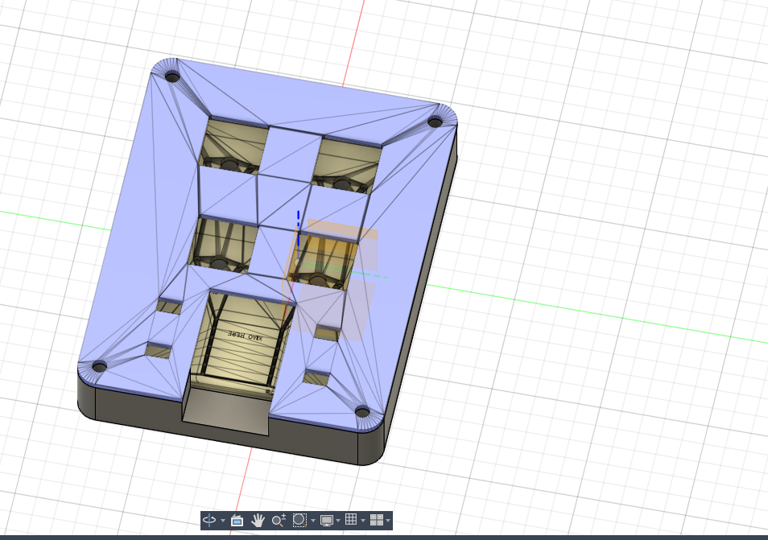
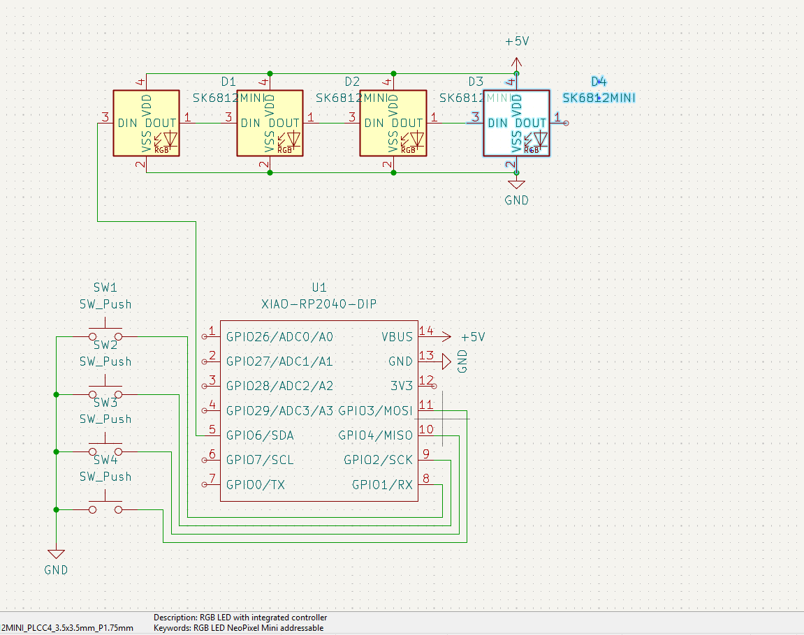
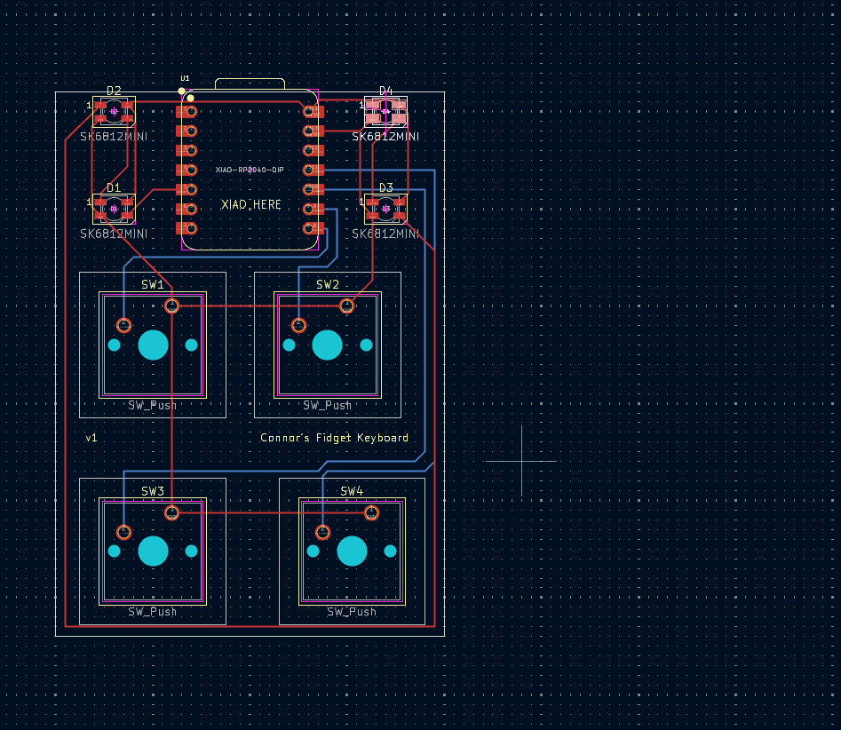
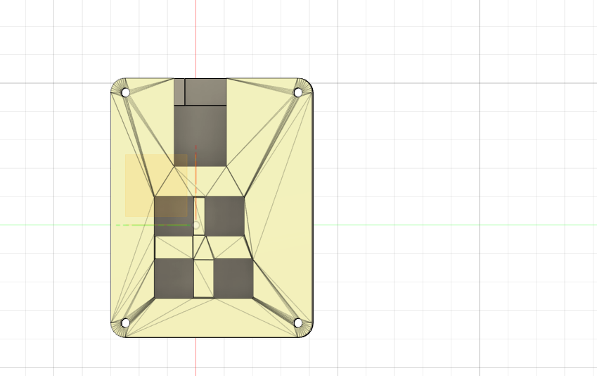

# Hackclub-Mini-Board

# Overall Hackpad

# Schematic

# PCB

# Case

# BOM
- Seeed XIAO RP2040 
- 4 MX-Style Switches
- 4 Blank DSA Keycaps
- 4 SK6812 Mini-E LEDs
- 4 m3x16mm Screws
- 4 m3x5mx4mm Heatset Inserts
- Custom 3d Printed Case

This was such a hard thing to make but it is cool how much i learned and i want to try and make another custom one soon with a screen like some of the examples showed.
